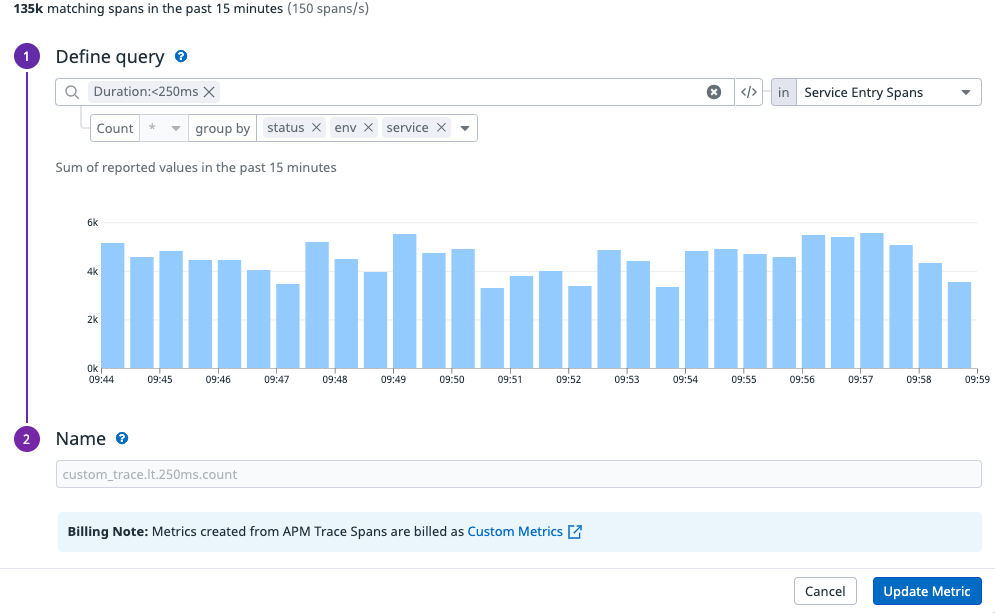

[//]: # (This file is generated. Do not edit, module description can be added by editing / creating module_description.md)

# Terraform module for Datadog Apm

This module adds error and latency monitoring for APM data.
It also includes SLO's for errors and latency but this requires some manual actions first.
Datadog has a feature to generated metrics based on APM data.
Unfortunately this is not a feature you can configure with Terraform.
You'll have to create these metrics by hand unfortunately :( 

In Datadog go to APM -> Setup and Configuration -> Generate Metrics -> New Metric

First create this one


Based on this hits metric we create our Errors SLO

Then you should pick a few latency buckets for example:
- 100ms
- 250ms
- 500ms
- 1000ms



Based on these buckets and also the hits metric we generate our Latency SLO.

This module is part of a larger suite of modules that provide alerts in Datadog.
Other modules can be found on the [Terraform Registry](https://registry.terraform.io/search/modules?namespace=kabisa&provider=datadog)

We have two base modules we use to standardise development of our Monitor Modules:
- [generic monitor](https://github.com/kabisa/terraform-datadog-generic-monitor) Used in 90% of our alerts
- [service check monitor](https://github.com/kabisa/terraform-datadog-service-check-monitor)

Modules are generated with this tool: https://github.com/kabisa/datadog-terraform-generator

Monitors:
* [Terraform module for Datadog Apm](#terraform-module-for-datadog-apm)
  * [Request Rate](#request-rate)
  * [Error Percentage](#error-percentage)
  * [Request Rate Anomaly](#request-rate-anomaly)
  * [Latency P95](#latency-p95)
  * [Latency Slo](#latency-slo)
  * [Apdex](#apdex)
  * [Errors Slo](#errors-slo)
  * [Latency](#latency)
  * [Module Variables](#module-variables)

# Getting started developing
[pre-commit](http://pre-commit.com/) was used to do Terraform linting and validating.

Steps:
   - Install [pre-commit](http://pre-commit.com/). E.g. `brew install pre-commit`.
   - Run `pre-commit install` in this repo. (Every time you cloud a repo with pre-commit enabled you will need to run the pre-commit install command)
   - That’s it! Now every time you commit a code change (`.tf` file), the hooks in the `hooks:` config `.pre-commit-config.yaml` will execute.

## Request Rate

Number of requests per second

Query:
```terraform
avg(last_30m):sum:trace.${var.trace_span_name}.hits{tag:xxx}.as_rate() > 
```

| variable                       | default                       | required | description                      |
|--------------------------------|-------------------------------|----------|----------------------------------|
| request_rate_enabled           | True                          | No       |                                  |
| request_rate_warning           | None                          | No       |                                  |
| request_rate_critical          |                               | Yes      |                                  |
| request_rate_evaluation_period | last_30m                      | No       |                                  |
| request_rate_note              | ""                            | No       |                                  |
| request_rate_docs              | Number of requests per second | No       |                                  |
| request_rate_filter_override   | ""                            | No       |                                  |
| request_rate_alerting_enabled  | True                          | No       |                                  |
| request_rate_priority          | 3                             | No       | Number from 1 (high) to 5 (low). |


## Error Percentage

Query:
```terraform
avg(last_10m):100 * (sum:trace.${var.trace_span_name}.errors{tag:xxx}.as_rate() / sum:trace.${var.trace_span_name}.hits{tag:xxx}.as_rate() ) > 0.05
```

| variable                           | default  | required | description                      |
|------------------------------------|----------|----------|----------------------------------|
| error_percentage_enabled           | True     | No       |                                  |
| error_percentage_warning           | 0.01     | No       |                                  |
| error_percentage_critical          | 0.05     | No       |                                  |
| error_percentage_evaluation_period | last_10m | No       |                                  |
| error_percentage_note              | ""       | No       |                                  |
| error_percentage_docs              | ""       | No       |                                  |
| error_percentage_filter_override   | ""       | No       |                                  |
| error_percentage_alerting_enabled  | True     | No       |                                  |
| error_percentage_priority          | 3        | No       | Number from 1 (high) to 5 (low). |


## Request Rate Anomaly

Request rate anomaly detection is performed by taking the standard deviation and put a band around it. If X percentage of the requests are outside that band, an alert is raised. https://www.datadoghq.com/blog/introducing-anomaly-detection-datadog/

Query:
```terraform
avg(last_30m):anomalies(sum:trace.${var.trace_span_name}.hits{tag:xxx}.as_rate(), 'agile', ${var.request_rate_anomaly_std_dev_count}, direction='both', alert_window='${var.request_rate_anomaly_trigger_window}', interval=60, count_default_zero='false', seasonality='weekly') > 0.2
```

| variable                               | default                                  | required | description                                                                       |
|----------------------------------------|------------------------------------------|----------|-----------------------------------------------------------------------------------|
| request_rate_anomaly_enabled           | False                                    | No       |                                                                                   |
| request_rate_anomaly_warning           | 0.15                                     | No       |                                                                                   |
| request_rate_anomaly_critical          | 0.2                                      | No       |                                                                                   |
| request_rate_anomaly_evaluation_period | last_30m                                 | No       |                                                                                   |
| request_rate_anomaly_trigger_window    | last_30m                                 | No       |                                                                                   |
| request_rate_anomaly_recovery_window   | last_15m                                 | No       |                                                                                   |
| request_rate_anomaly_note              | ""                                       | No       |                                                                                   |
| request_rate_anomaly_docs              | Request rate anomaly detection is performed by taking the standard deviation and put a band around it. If X percentage of the requests are outside that band, an alert is raised. https://www.datadoghq.com/blog/introducing-anomaly-detection-datadog/ | No       |                                                                                   |
| request_rate_anomaly_filter_override   | ""                                       | No       |                                                                                   |
| request_rate_anomaly_alerting_enabled  | True                                     | No       |                                                                                   |
| request_rate_anomaly_priority          | 3                                        | No       | Number from 1 (high) to 5 (low).                                                  |
| request_rate_anomaly_std_dev_count     | 5                                        | No       | Request rate anomaly, how many standard deviations are needed to trigger an alert |


## Latency P95

Query:
```terraform
avg(last_10m):p95:trace.${var.trace_span_name}{${local.latency_filter}} > 1.3
```

| variable                      | default  | required | description                      |
|-------------------------------|----------|----------|----------------------------------|
| latency_p95_enabled           | True     | No       |                                  |
| latency_p95_warning           | 0.9      | No       |                                  |
| latency_p95_critical          | 1.3      | No       |                                  |
| latency_p95_evaluation_period | last_10m | No       |                                  |
| latency_p95_note              | ""       | No       |                                  |
| latency_p95_docs              | ""       | No       |                                  |
| latency_p95_alerting_enabled  | True     | No       |                                  |
| latency_p95_priority          | 3        | No       | Number from 1 (high) to 5 (low). |


## Latency Slo

| variable                     | default    | required | description                                                                                          |
|------------------------------|------------|----------|------------------------------------------------------------------------------------------------------|
| latency_slo_enabled          | False      | No       | Note that this monitor requires custom metrics to be present. Those can unfortunately not be created with Terraform yet |
| latency_slo_note             | ""         | No       |                                                                                                      |
| latency_slo_docs             | ""         | No       |                                                                                                      |
| latency_slo_filter_override  | ""         | No       |                                                                                                      |
| latency_slo_warning          | None       | No       |                                                                                                      |
| latency_slo_critical         | 99.9       | No       |                                                                                                      |
| latency_slo_alerting_enabled | True       | No       |                                                                                                      |
| latency_slo_status_ok_filter | ,status:ok | No       | Filter string to select the non-errors for the latency SLO, Dont forget to include the comma or (AND or OR) keywords |
| latency_slo_ms_bucket        | 250        | No       | We defined several latency buckets with custom metrics based on the APM traces that come in. Our buckets are 100, 250, 500, 1000, 2500, 5000, 10000 |
| latency_slo_timeframe        | 30d        | No       |                                                                                                      |


## Apdex

Apdex is a measure of response time based against a set threshold. It measures the ratio of satisfactory response times to unsatisfactory response times. The response time is measured from an asset request to completed delivery back to the requestor. For more see: https://en.wikipedia.org/wiki/Apdex#Apdex_method

Query:
```terraform
avg(last_10m):avg:trace.${var.trace_span_name}.apdex.by.service{tag:xxx} < 0.8
```

| variable                | default                                  | required | description                      |
|-------------------------|------------------------------------------|----------|----------------------------------|
| apdex_enabled           | False                                    | No       |                                  |
| apdex_warning           | 0.9                                      | No       |                                  |
| apdex_critical          | 0.8                                      | No       |                                  |
| apdex_evaluation_period | last_10m                                 | No       |                                  |
| apdex_note              | ""                                       | No       |                                  |
| apdex_docs              | Apdex is a measure of response time based against a set threshold. It measures the ratio of satisfactory response times to unsatisfactory response times. The response time is measured from an asset request to completed delivery back to the requestor. For more see: https://en.wikipedia.org/wiki/Apdex#Apdex_method | No       |                                  |
| apdex_filter_override   | ""                                       | No       |                                  |
| apdex_alerting_enabled  | True                                     | No       |                                  |
| apdex_priority          | 3                                        | No       | Number from 1 (high) to 5 (low). |


## Errors Slo

| variable                      | default       | required | description                                                                                          |
|-------------------------------|---------------|----------|------------------------------------------------------------------------------------------------------|
| error_slo_enabled             | True          | No       |                                                                                                      |
| error_slo_note                | ""            | No       |                                                                                                      |
| error_slo_docs                | ""            | No       |                                                                                                      |
| error_slo_filter_override     | ""            | No       |                                                                                                      |
| error_slo_warning             | None          | No       |                                                                                                      |
| error_slo_critical            | 99.9          | No       |                                                                                                      |
| error_slo_alerting_enabled    | True          | No       |                                                                                                      |
| error_slo_status_ok_filter    | ,status:ok    | No       | Filter string to select the non-errors for the SLO, Dont forget to include the comma or (AND or OR) keywords |
| error_slo_status_error_filter | ,status:error | No       | Filter string to select the non-errors for the SLO, Dont forget to include the comma or (AND or OR) keywords |
| error_slo_timeframe           | 30d           | No       |                                                                                                      |


## Latency

Query:
```terraform
avg(last_10m):avg:trace.${var.trace_span_name}{tag:xxx} > 0.5
```

| variable                  | default  | required | description                      |
|---------------------------|----------|----------|----------------------------------|
| latency_enabled           | True     | No       |                                  |
| latency_warning           | 0.3      | No       |                                  |
| latency_critical          | 0.5      | No       |                                  |
| latency_evaluation_period | last_10m | No       |                                  |
| latency_note              | ""       | No       |                                  |
| latency_docs              | ""       | No       |                                  |
| latency_filter_override   | ""       | No       |                                  |
| latency_alerting_enabled  | True     | No       |                                  |
| latency_priority          | 3        | No       | Number from 1 (high) to 5 (low). |


## Module Variables

| variable                        | default      | required | description                                                                                          |
|---------------------------------|--------------|----------|------------------------------------------------------------------------------------------------------|
| env                             |              | Yes      |                                                                                                      |
| alert_env                       |              | Yes      |                                                                                                      |
| service                         |              | Yes      |                                                                                                      |
| service_display_name            | None         | No       |                                                                                                      |
| trace_span_name                 | http.request | No       | Traces contain a span name. Example:
  trace.<SPAN_NAME>.<METRIC_SUFFIX>
  trace.<SPAN_NAME>.<METRIC_SUFFIX>.<2ND_PRIM_TAG>_service

The name of the operation or span.name (examples: redis.command, pylons.request, rails.request, mysql.query
https://docs.datadoghq.com/tracing/guide/metrics_namespace/ |
| notification_channel            |              | Yes      |                                                                                                      |
| additional_tags                 | []           | No       |                                                                                                      |
| name_prefix                     | ""           | No       |                                                                                                      |
| name_suffix                     | ""           | No       |                                                                                                      |
| locked                          | True         | No       |                                                                                                      |
| latency_excluded_resource_names | []           | No       | List of resource names to exclude in latency oriented monitors or SLOs. Some requests might be batch requests |
| filters_str_override            | None         | No       |                                                                                                      |


