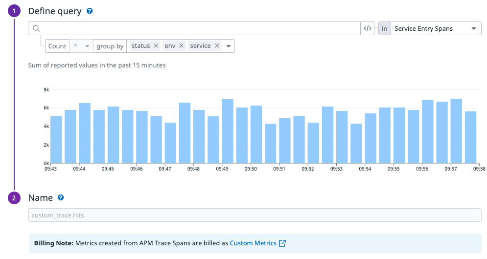

This module provides SLO's and other alerts based on APM data.
Note that it's this module's opinion that you should prefer to alert on SLO burn rates in stead of latency thresholds.

There is also some backwards compatibility if you want to use generated metrics for your SLO's

## OLD SOLUTION FOR SLO's

Before datadog supported latency SLO's we used generated metrics to base our SLO's on.
Creating the generated metrics is not something you can do with Terraform.
You'll have to create these metrics by hand if you need/want this.

In Datadog go to APM -> Setup and Configuration -> Generate Metrics -> New Metric

First create this one

Based on this hits metric we create our Errors SLO

Then you should pick a few latency buckets for example:
- 100ms
- 250ms
- 500ms
- 1000ms

Based on these buckets and also the hits metric we generate our Latency SLO.
