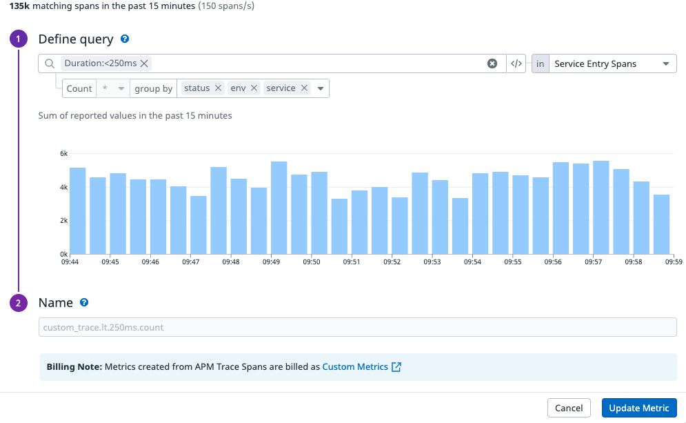

This module adds error and latency monitoring for APM data.
It also includes SLO's for errors and latency but this requires some manual actions first.
Datadog has a feature to generated metrics based on APM data.
Unfortunately this is not a feature you can configure with Terraform.
You'll have to create these metrics by hand unfortunately :( 

In Datadog go to APM -> Setup and Configuration -> Generate Metrics -> New Metric

First create this one

Based on this hits metric we create our Errors SLO

Then you should pick a few latency buckets for example:
- 100ms
- 250ms
- 500ms
- 1000ms

Based on these buckets and also the hits metric we generate our Latency SLO.
